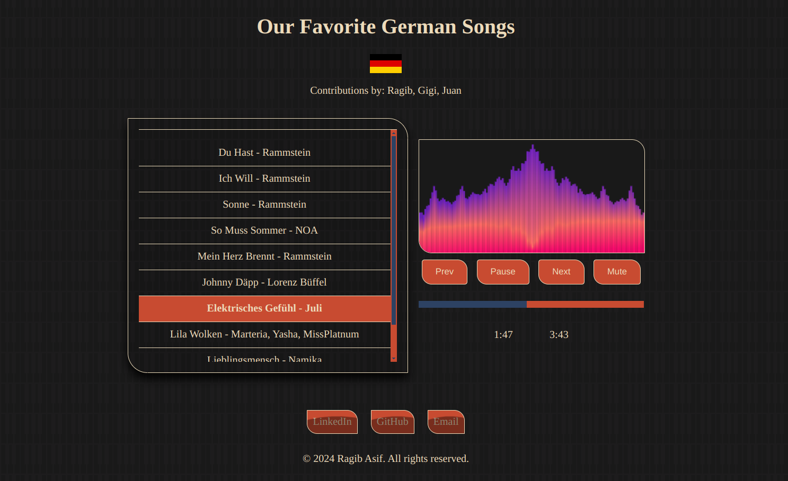

# Music Visualizer

This website allows users to play songs with an engaging visualizer. It offers
intuitive controls for playing, pausing, and navigating through songs.
The design is aesthetically pleasing, easy to navigate, and fully responsive
across all devices.



## Features

- Play/Pause: Start and stop the music with a single button.
- Next/Previous: Navigate to the next or previous song in the playlist.
- Visualizer: Dynamic visual effects that react to the music being played.
- Responsive Design: Optimized for viewing on all devices, including desktops, tablets, and mobile phones.
- User-Friendly Interface: Clean, modern, and easy-to-use controls.

## Technologies Used

- HTML5: Structure of the website.
- CSS3: Styling and layout, including animations and responsiveness.
- JavaScript: Functionality for music control and visualizer.

## Installation

1. Clone the repository:
```bash
git clone https://github.com/ragibasif/music-visualizer.git
```

2. Navigate to the project directory:
```bash
cd music-visualizer
```

3. Open index.html in your preferred web browser.

## Usage

1. Play Music: Click the play button to start the music and the visualizer.
2. Pause Music: Click the pause button to stop the music.
3. Next Song: Click the next button to skip to the next song.
4. Previous Song: Click the previous button to go back to the previous song.
5. Volume Control: Adjust the volume using the slider.

## File Structure

```bash
music-visualizer/
│
├── index.html
├── styles.css
├── scripts.js
├── music/
├── img/
└── songs.json
└── LICENSE
└── README.md
```

## Contributing

0. Read the [DOCUMENTATION](DOCUMENTATION.md).
1. Fork the repository.
2. Create a new branch (git checkout -b feature-branch).
3. Commit your changes (git commit -am 'Add new feature').
4. Push to the branch (git push origin feature-branch).
5. Create a new Pull Request.

## License

This project is licensed under the [MIT](https://choosealicense.com/licenses/mit/) License.
